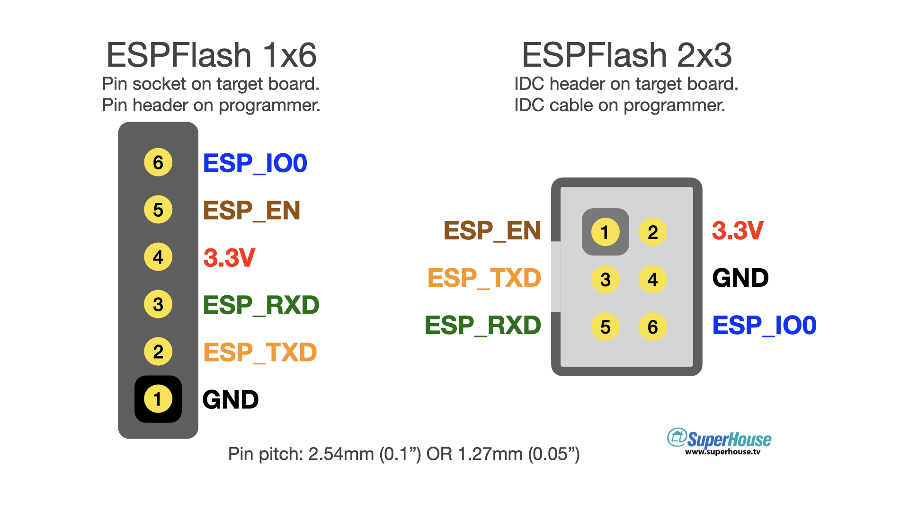

ESPFlash Programming Header Pinout
==================================

ESPFlash is a convention for programming header connections to PCBs
designed with the Espressif ESP8266, ESP8285, and ESP32 MCUs.

The convention allows for both 1x6 and 2x3 format headers, in either
2.54mm (0.1") or 1.27mm (0.05") sizes.

More information is available at https://www.superhouse.tv/espflash

Ideally I want other people to use this header format to make their
own programmers, but to make it easy to incorporate into your project
without having to make a programmer I've also made my "ESPFlasher"
implementation available for purchase.

==Resources==

 * [ESPFlash header definition](https://www.superhouse.tv/espflash)
 * [SuperHouse 42: The ESPFlash programming header for ESP8266/ESP32](https://www.superhouse.tv/42-the-espflash-programming-header-for-esp8266-esp32/)
 * [Vlog 66: Let's define a standard ESP8266/ESP32 programming header](https://www.superhouse.tv/vlog-66-lets-define-a-standard-esp8266-esp32-programming-header/)
 * [ESPFlasher ESP8266/ESP32 programmer](https://www.superhouse.tv/espflasher)
